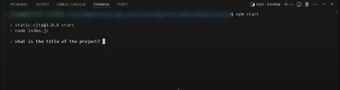
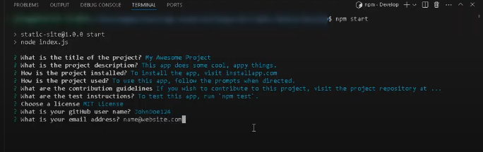
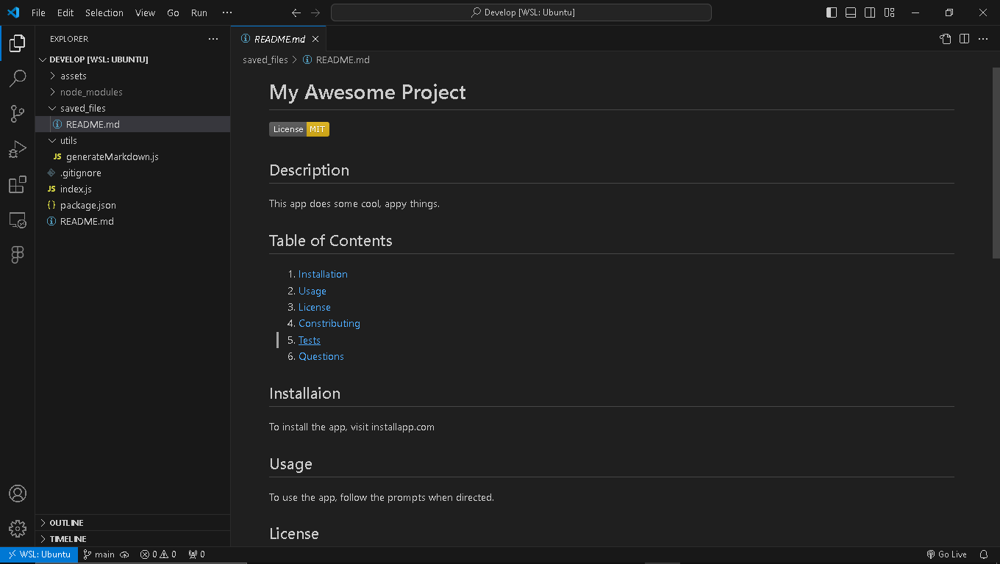

# Super Rad ReadMe Writer
  
  ## Description
  This app allows the user to generate a README.md.
  The file is generated based on user input to prompt questions.
  ## Table of Contents

  1. [Installation](#Installation)
  2. [Usage](#Usage)
  3. [License](#License)
  4. [Questions](#Questions)

  ## Installaion
  This app can be used by forking the gitHub repository and cloning it to the user's local machine. 
  The repository for this app can be found [here](https://github.com/JFleming963/Super-Rad-ReadMe-Writer).  
  Then, from within the project directory the user must run `npm install` to download the necessary node modules.
  ## Usage
  To start the app, run `npm start`.
   
  Then, the a series of questions will be prompted in the console.
  
  After the user answers the questions, a markdown file named `README.md` will be saved into the subfolder `saved_files`.
  
  
  
  
  ***
  A video walk-through can be found at this link: 
  [Video Walk-through](https://drive.google.com/file/d/1d90e2LWyaHxKBE7qns6RAM31CTB8-8Au/view?usp=sharing)

  ## License
  This software uses the MIT License.
  ## Questions
  To see more projects or to contribute, please visit [My GitHub Profile](https://github.com/www).
